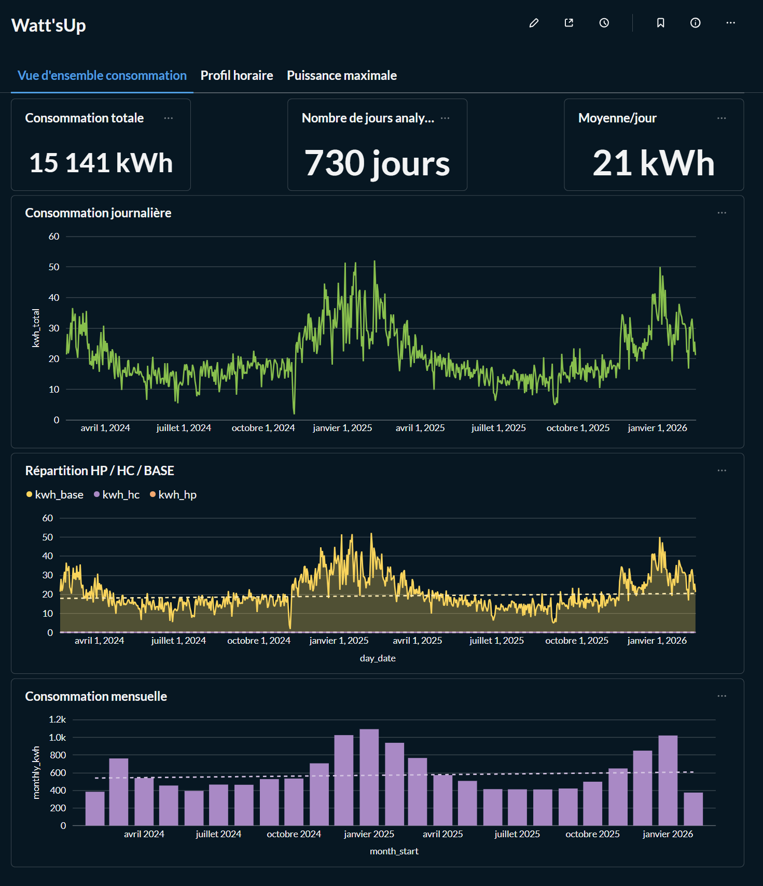
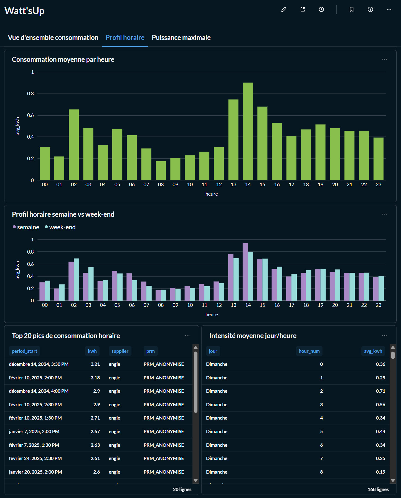
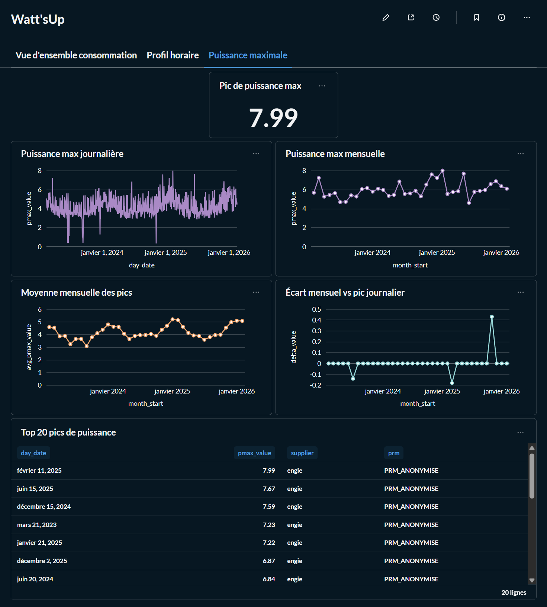

Watt'sUp — Suivi conso électricité (Engie → PostgreSQL → dbt → Metabase)


Watt’sUp est un projet portfolio orienté Data Engineering / Analytics.  
L’objectif est de transformer des exports fournisseur réels en données propres, testées et exploitables pour analyser la consommation électrique d’un foyer.
Le projet couvre :
l’ingestion de fichiers Engie
le stockage dans PostgreSQL
la modélisation avec dbt
les tests de qualité
la visualisation dans Metabase
---
Objectif
Construire un pipeline local, simple et reproductible pour répondre à des questions concrètes :
quelle est la consommation totale observée ?
comment évolue la consommation au fil du temps ?
quelles sont les heures de pointe ?
quelle différence entre semaine et week-end ?
quels sont les pics de puissance maximale ?
---
Données prises en charge
Le projet supporte actuellement des exports Engie de type :
consommation mensuelle
consommation horaire
puissance maximale journalière
puissance maximale mensuelle
Les identifiants sensibles sont anonymisés dans les restitutions (`PRM_ANONYMISE`).
---
Stack technique
Python
PostgreSQL
dbt
Docker Compose
Metabase
GitHub Actions
GitHub Pages pour la documentation dbt
---
Architecture
```text
Exports Engie (CSV/XLSX)
        ↓
Python ingestion
        ↓
raw.supplier_meter_readings
raw.supplier_power_max
        ↓
dbt staging
        ↓
dbt marts
        ↓
Metabase dashboards
```
---
Structure du projet
```text
.
├── data/raw/                  # fichiers source locaux
├── dbt/wattsup/
│   ├── models/staging/        # normalisation des données brutes
│   ├── models/marts/          # tables analytiques
│   └── tests/                 # tests dbt
├── docs/screenshots/          # captures des dashboards
├── ingest/                    # scripts d’ingestion Python
├── postgres/                  # initialisation PostgreSQL
├── scripts/                   # scripts d’exécution locale
├── docker-compose.yml
└── README.md
```
---
Modèles dbt principaux
Staging
`stg_supplier_meter_readings_hourly`
`stg_supplier_meter_readings_monthly`
`stg_supplier_power_max_daily`
`stg_supplier_power_max_monthly`
Marts
`fct_energy_hourly`
`agg_energy_daily`
`fct_power_max_daily`
`agg_power_max_monthly`
---
Qualité des données
Le projet inclut des tests dbt sur :
valeurs nulles
valeurs autorisées (`grain`)
cohérence des périodes
consommation négative
puissance négative
champs clés de restitution
Build validé sur la V1 :
92 tests passés
0 erreur
0 warning
---
Dashboards Metabase
1. Vue d’ensemble consommation
consommation totale
nombre de jours analysés
moyenne journalière
consommation journalière
répartition journalière
consommation mensuelle

2. Profil horaire
consommation moyenne par heure
comparaison semaine vs week-end
top 20 pics de consommation horaire
intensité moyenne jour/heure

3. Puissance maximale
pic de puissance max
puissance max journalière
puissance max mensuelle
moyenne mensuelle des pics
écart mensuel vs pic journalier
top 20 pics de puissance

---
Lancer le projet en local
1. Démarrer PostgreSQL et Metabase
```powershell
docker compose up -d postgres metabase
```
Metabase sera disponible sur :
```text
http://localhost:3001
```
2. Installer les dépendances Python
```powershell
python -m pip install -r requirements.txt
```
3. Ingestion des exports Engie
```powershell
python .\ingest\ingest_engie_exports.py `
  --supplier engie `
  --prm "PRM_ANONYMISE" `
  --files `
    ".\data\raw\Relèves_mensuelles_électricité.csv" `
    ".\data\raw\Relèves_horaires_électricité.xlsx" `
    ".\data\raw\puissance_journaliere_max_linky.csv" `
    ".\data\raw\puissance_mensuelle_max_linky.csv"
```
4. Construire les modèles dbt
```powershell
docker compose run --rm dbt build
```
5. Générer la documentation dbt
```powershell
docker compose run --rm dbt docs generate
```
---
Ce que le projet démontre
Ce projet montre ma capacité à :
ingérer des fichiers réels hétérogènes
modéliser une donnée exploitable avec dbt
mettre en place des tests de qualité
produire des indicateurs analytiques lisibles
relier une logique technique à un besoin métier concret
---
Positionnement portfolio
Watt’sUp illustre un cas concret de mini-stack data reproductible :
ingestion
stockage
transformation
validation
visualisation
C’est un projet conçu pour démontrer une approche pragmatique de Data Engineer / Data Analyst, proche des contraintes rencontrées en contexte réel.
---
Pistes d’évolution
support multi-fournisseurs
harmonisation métier kW / kVA
enrichissement météo / saisonnalité
alertes sur anomalies de consommation
dashboard plus “produit”
industrialisation CI/CD plus poussée
---
Auteur
David Limoisin  
Data Engineer / SQL / BI
GitHub : Kamo-data